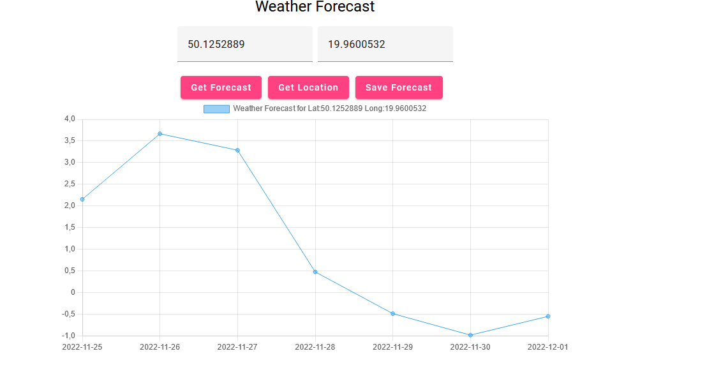

To Run UI get into Weather.UI folder and:
 
1.install node (npm)
 
https://nodejs.org/en/download/
 
2. Then you need to install angular
 
`npm install -g @angular/cli`
 
3. Run UI
 
`ng serve - o`
 

To Run API, open WeatherAPI.sln , and run it.

Screen Example on running UI:

